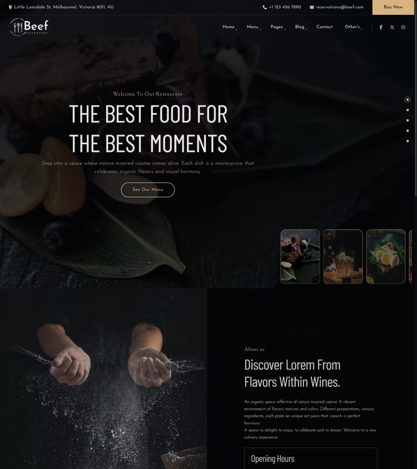
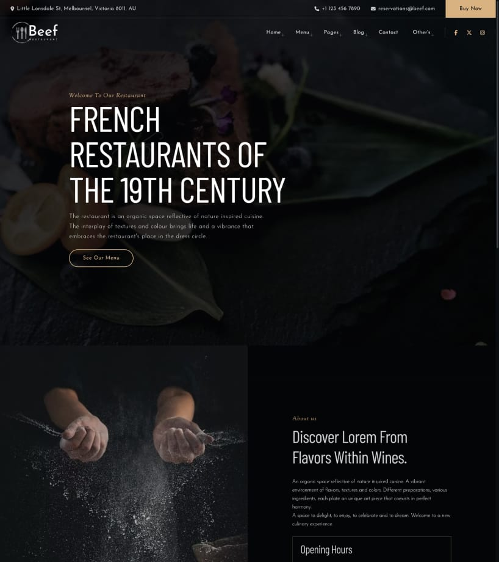
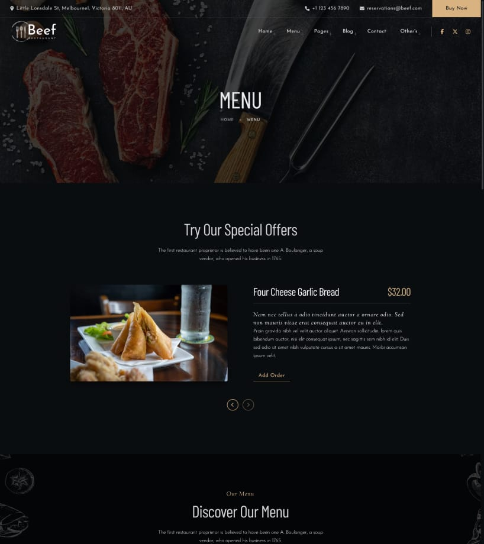
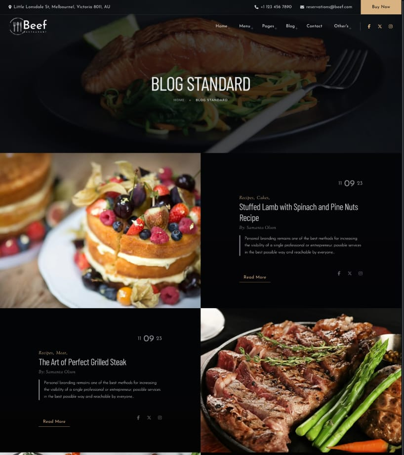
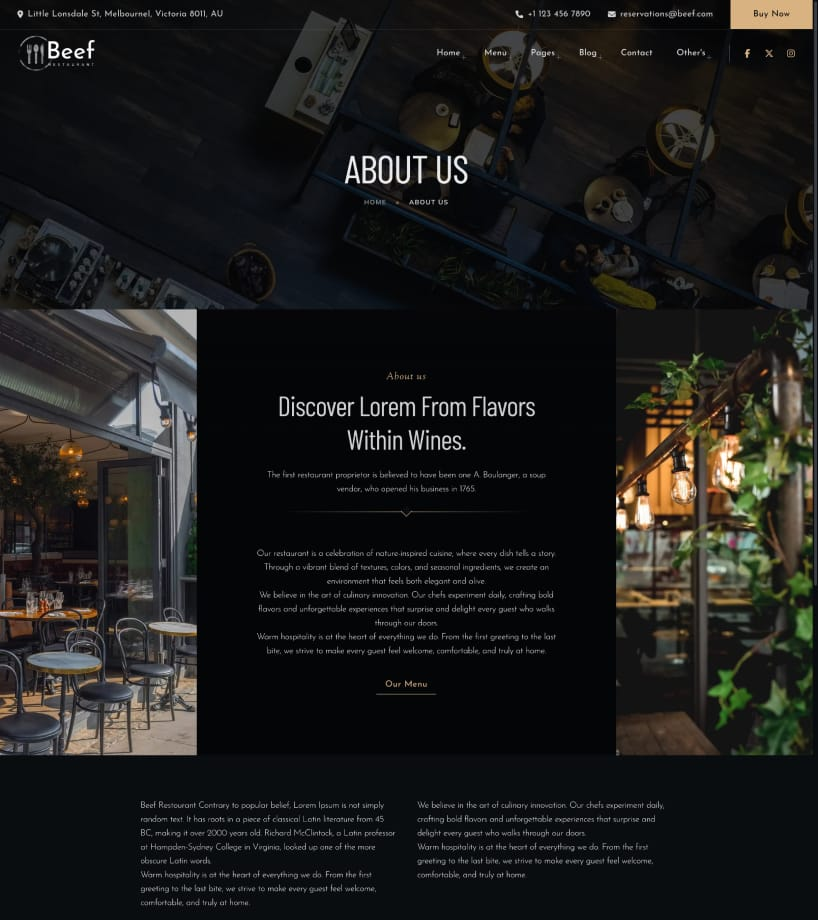
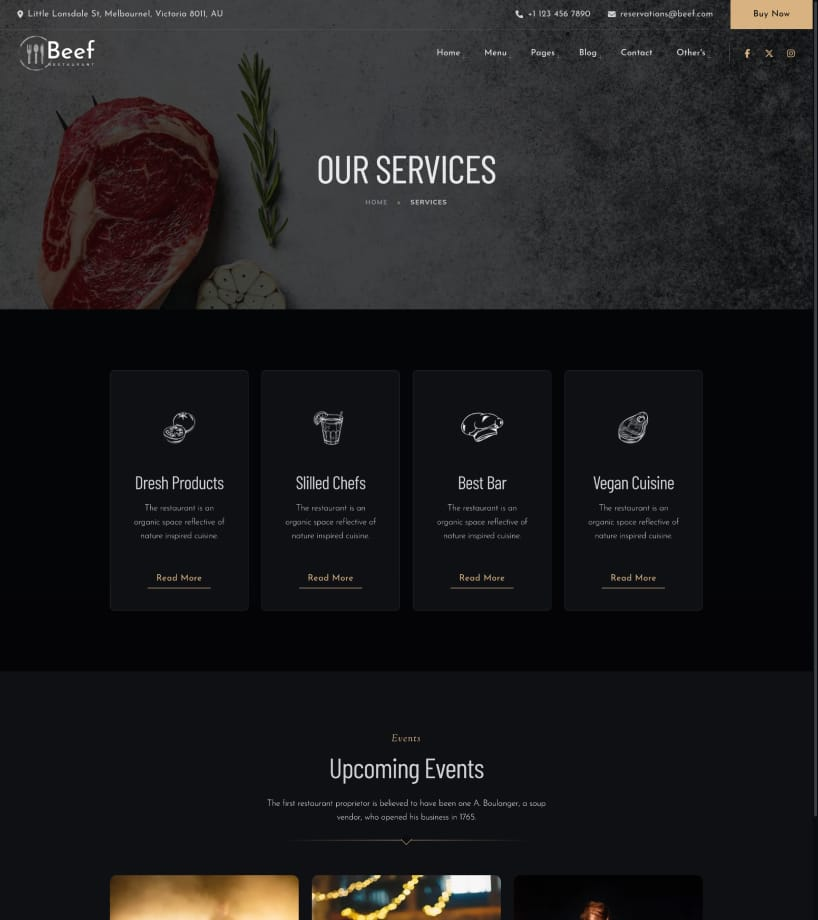

# 🥩 Beef - Elegant Restaurant Template

[](https://nextjs.org/)
[](https://www.typescriptlang.org/)
[](https://tailwindcss.com/)
[](./LICENSE)

**Beef** is a premium, elegant restaurant template built with Next.js 14, TypeScript, and Tailwind CSS. Perfect for restaurants, cafes, bistros, and food businesses looking for a modern, high-performance web presence.

---

## ✨ Features

### 🎨 **Design & User Experience**
- ✓ **2 Unique Home Page Designs** - Creative and Classic variants
- ✓ **Elegant Typography** - Custom font combinations (Barlow Condensed, Sorts Mill Goudy)
- ✓ **Smooth Animations** - Powered by Framer Motion and GSAP
- ✓ **Fully Responsive** - Perfect on all devices (mobile, tablet, desktop)
- ✓ **Modern UI Components** - Built with Radix UI for accessibility

### 📱 **Pages Included**
- ✓ Home Pages (2 variants: Creative & Classic)
- ✓ About Us
- ✓ Menu Pages (4 layouts: Standard, Tabs, Sidebar, Full-width)
- ✓ Chefs/Team
- ✓ Services
- ✓ History/Timeline
- ✓ Contact Us
- ✓ Confirmation Page
- ✓ Coming Soon
- ✓ Blog System (with categories, tags, authors, search)
- ✓ 404 Error Page

### 📝 **Blog Features**
- ✓ Blog listing with grid layout
- ✓ Individual blog post pages
- ✓ Category filtering
- ✓ Tag filtering
- ✓ Author profiles
- ✓ Search functionality
- ✓ Comments system (UI ready)
- ✓ Social sharing
- ✓ Sidebar widgets

### 🎯 **Menu Displays**
- ✓ **Menu Standard** - Classic menu layout
- ✓ **Menu with Tabs** - Categorized with tab navigation
- ✓ **Menu with Sidebar** - Sticky navigation sidebar
- ✓ **Full-width Menu** - Showcase dishes in full width

### 🚀 **Technical Features**
- ✓ **Next.js 14** - App Router with SSG (Static Site Generation)
- ✓ **TypeScript** - Fully typed for better developer experience
- ✓ **Tailwind CSS** - Utility-first CSS framework
- ✓ **SEO Optimized** - Meta tags, OpenGraph, structured data ready
- ✓ **Performance Optimized** - Lighthouse score ready
- ✓ **Image Optimization** - Next.js Image component
- ✓ **Code Splitting** - Automatic code splitting for faster loads
- ✓ **Modern ES6+** - Latest JavaScript features

### 🛠️ **Developer Features**
- ✓ Clean, organized code structure
- ✓ Reusable components
- ✓ Custom hooks for data management
- ✓ Easy to customize and extend
- ✓ Detailed code comments
- ✓ ESLint configured
- ✓ Git-friendly project structure

---

## 📋 Table of Contents

- [Demo](#-demo)
- [Quick Start](#-quick-start)
- [Installation](#-installation)
- [Project Structure](#-project-structure)
- [Customization](#-customization)
- [Deployment](#-deployment)
- [Browser Support](#-browser-support)
- [Support](#-support)
- [Changelog](#-changelog)
- [License](#-license)

---

## 🎯 Demo

**Live Preview**: [View Demo](#) *(Add your demo link here)*

### Preview Screenshots

| Home Creative | Home Classic | Menu Page |
|:------------:|:------------:|:---------:|
|  |  |  |

| Blog Page | About Page | Services |
|:---------:|:----------:|:--------:|
|  |  |  |

---

## ⚡ Quick Start

Get up and running in less than 5 minutes:

```bash
# 1. Install dependencies
pnpm install --store-dir ~/.pnpm-store

# 2. Start development server
pnpm dev

# 3. Open your browser
# Visit http://localhost:4000
```

---

## 📦 Installation

### Prerequisites

Before you begin, ensure you have the following installed:

- **Node.js** >= 20.x ([Download](https://nodejs.org/))
- **pnpm** >= 8.x (recommended) or npm/yarn
  ```bash
  npm install -g pnpm
  ```

### Step-by-Step Installation

#### 1. **Extract the Template**
```bash
unzip beef-template.zip
cd beef-template
```

#### 2. **Install Dependencies**

⚠️ **Important**: Use the `--store-dir` flag to avoid issues with external drives:

```bash
pnpm install --store-dir ~/.pnpm-store
```

Or using npm:
```bash
npm install
```

#### 3. **Run Development Server**

```bash
# Using pnpm (recommended)
pnpm dev

# Or using npm
npm run dev
```

The application will start on **http://localhost:4000**

#### 4. **Build for Production**

```bash
# Using pnpm
pnpm build
pnpm start

# Or using npm
npm run build
npm start
```

---

## 📁 Project Structure

```
beef-template/
├── public/                  # Static assets
│   ├── sections/           # Section preview images
│   ├── blog/               # Blog images
│   ├── menu/               # Menu images
│   ├── team/               # Team/Chef images
│   ├── gallery/            # Gallery images
│   └── ...
├── src/
│   ├── app/
│   │   ├── (routes)/       # Application routes
│   │   │   ├── home-creative/
│   │   │   ├── home-classic/
│   │   │   ├── blog/       # Blog pages
│   │   │   ├── menu/       # Menu variants
│   │   │   └── ...
│   │   ├── blocks/         # Reusable blocks
│   │   │   ├── about/
│   │   │   ├── blog/
│   │   │   ├── gallery/
│   │   │   ├── menu/
│   │   │   └── ...
│   │   ├── components/     # Common components
│   │   │   ├── common/
│   │   │   └── layout/
│   │   ├── hooks/          # Custom hooks
│   │   ├── css/            # CSS modules
│   │   ├── globals.css     # Global styles
│   │   └── layout.tsx      # Root layout
│   ├── lib/                # Utility functions
│   └── types/              # TypeScript definitions
├── .eslintrc.json          # ESLint configuration
├── tailwind.config.ts      # Tailwind configuration
├── tsconfig.json           # TypeScript configuration
├── next.config.mjs         # Next.js configuration
├── package.json            # Dependencies
└── README.md               # This file
```

---

## 🎨 Customization

### Change Colors

Edit `tailwind.config.ts`:

```typescript
colors: {
  primary: '#d4af37',      // Golden accent color
  'text-base': '#1a1a1a',  // Main text color
  // Add your custom colors
}
```

### Change Fonts

Fonts are configured in `src/app/layout.tsx`:

```typescript
const barlow = Barlow_Condensed({
  subsets: ['latin'],
  weight: ['300', '400', '500', '600', '700'],
  variable: '--font-barlow-condensed',
});
```

### Modify Content

Content is managed through custom hooks in `src/app/hooks/`:

- `data-general.tsx` - General site information
- `data-menu.tsx` - Menu items
- `data-team.tsx` - Team members
- `data-blog.tsx` - Blog posts
- And more...

### Add New Pages

1. Create a new folder in `src/app/(routes)/`
2. Add a `page.tsx` file
3. Next.js will automatically create the route

Example:
```bash
src/app/(routes)/reservations/page.tsx
# Available at: /reservations
```

### Customize Animations

Animations are configured in:
- **Framer Motion** - Used in components
- **GSAP** - Advanced scroll animations
- **Tailwind animate** - Utility animations

---

## 🚀 Deployment

### Deploy to Vercel (Recommended)

[](https://vercel.com/new)

1. Push your code to GitHub/GitLab/Bitbucket
2. Import project in Vercel
3. Vercel will auto-detect Next.js
4. Deploy!

### Deploy to Netlify

1. Build the project:
   ```bash
   pnpm build
   ```
2. Deploy the `.next` folder to Netlify

### Deploy to Custom Server

```bash
# Build
pnpm build

# Start production server
pnpm start
```

Or use PM2 for process management:
```bash
pm2 start "pnpm start" --name beef-restaurant
```

### Environment Variables

Create `.env.local` for environment-specific variables:

```env
# Example
NEXT_PUBLIC_SITE_URL=https://yoursite.com
NEXT_PUBLIC_GA_ID=UA-XXXXXXXXX-X
```

---

## 🌐 Browser Support

- ✓ Chrome (latest)
- ✓ Firefox (latest)
- ✓ Safari (latest)
- ✓ Edge (latest)
- ✓ Opera (latest)
- ✓ Mobile browsers (iOS Safari, Chrome Android)

---

## 💡 Development Scripts

```bash
# Start development server (port 4000)
pnpm dev

# Build for production
pnpm build

# Start production server
pnpm start

# Lint code
pnpm lint

# Fix linting issues
pnpm lint --fix
```

---

## 🔧 Tech Stack

| Technology | Version | Purpose |
|------------|---------|---------|
| **Next.js** | 14.2.35 | React framework |
| **React** | 18.3.1 | UI library |
| **TypeScript** | 5.8.3 | Type safety |
| **Tailwind CSS** | 3.4.17 | Styling |
| **Framer Motion** | 11.18.2 | Animations |
| **GSAP** | 3.13.0 | Advanced animations |
| **Swiper** | 12.1.2 | Carousels |
| **Radix UI** | Latest | Accessible components |
| **Lucide Icons** | 0.441.0 | Icon library |

---

## 📚 Resources

- [Next.js Documentation](https://nextjs.org/docs)
- [TypeScript Handbook](https://www.typescriptlang.org/docs/)
- [Tailwind CSS Docs](https://tailwindcss.com/docs)
- [Framer Motion API](https://www.framer.com/motion/)

---

## 🆘 Support

### Documentation
Full documentation is available in the `/docs` folder (if provided).

### Support Channels

- **Email Support**: [your-support-email@example.com]
- **Support Period**: 6 months included
- **Response Time**: Within 24-48 hours (business days)

### Before Contacting Support

1. Check this README
2. Review the documentation
3. Check the [FAQ](#) section
4. Search for similar issues

### What's Included in Support

✓ Answering questions about template functionality
✓ Bug fixes and security updates
✓ Assistance with template features

### What's NOT Included

✗ Customization services
✗ Installation on your server
✗ Third-party plugin integration
✗ Training on HTML/CSS/JavaScript/React

---

## 🔄 Changelog

### Version 1.0.0 - Initial Release (February 2026)

**Features:**
- ✓ Initial release
- ✓ 2 home page designs
- ✓ 4 menu layouts
- ✓ Complete blog system
- ✓ 28+ pages
- ✓ Fully responsive design
- ✓ Next.js 14 with TypeScript
- ✓ Tailwind CSS styling
- ✓ Smooth animations

---

## 📄 License

This template is licensed under the Envato Market License.
See [LICENSE](./LICENSE) file for details.

**Quick Summary:**
- ✓ Use for single end product
- ✓ Modify and customize freely
- ✓ Use for client projects
- ✗ Cannot redistribute as-is
- ✗ Cannot use in SaaS without Extended License

For complete license terms: [Envato Market Licenses](https://themeforest.net/licenses)

---

## 🙏 Credits

### Third-Party Resources

- **Next.js** - Vercel
- **Tailwind CSS** - Tailwind Labs
- **Framer Motion** - Framer
- **GSAP** - GreenSock
- **Icons** - Lucide Icons
- **Fonts** - Google Fonts

### Images

Images used in the demo are for preview purposes only and are NOT included in the download. Please replace with your own images or use stock photos with proper licenses.

Recommended stock photo sources:
- [Unsplash](https://unsplash.com/) - Free
- [Pexels](https://www.pexels.com/) - Free
- [Freepik](https://www.freepik.com/) - Free & Premium

---

## ⭐ Rate This Template

If you enjoy using this template, please consider:

- ⭐ Rating it on ThemeForest
- 📝 Leaving a review
- 💬 Recommending to others

Your feedback helps us improve!

---

## 📧 Contact

For general inquiries:
- **Email**: [your-email@example.com]
- **Portfolio**: [your-portfolio-url]
- **ThemeForest**: [your-themeforest-profile]

---

<div align="center">

**Made with ❤️ by [Your Name/Company]**

[Website](#) • [ThemeForest](#) • [Support](#)

</div>

---

## 🔐 Security

If you discover a security vulnerability, please email [security@example.com] instead of using the issue tracker.

---

**Last Updated**: February 2026
**Version**: 1.0.0
**Next.js Version**: 14.2.35

---

© 2026 [Your Company Name]. All rights reserved.
